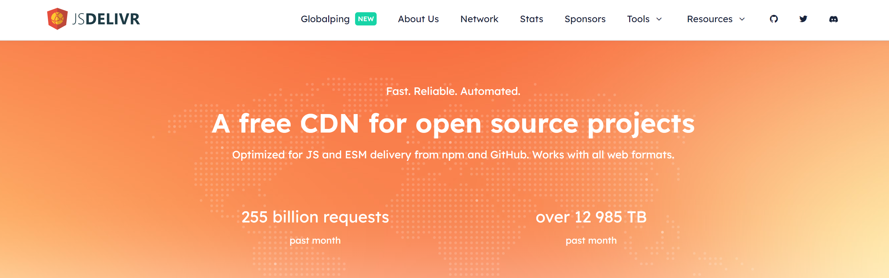

<p align='center'>
  
</p>

Part of the problems encountered in daily work, including HTML/CSS, JS, TypeScript, Vue2/Vue3, and React solution case collection.

<p align="center">
   
   
   
   
   
   
   
   
</p>

<br/>

<p align='center'>
  <a href='./README.md'>简体中文</a> | English
</p>

<br/>

> [!NOTE]
> If you think `daily_demo` is helpful to you, or if you like this project, please give it a star ⭐ ️, this will be a great encouragement for me, thank you for your support!

## Intro

Intended to record some of the problems and solutions encountered in daily work, or to share interesting code encountered during continuous learning, mainly involving front-end languages, frameworks, building aids, third-party code libraries, and tool functions written by oneself.

## Resource List

<details><summary>📝 Plain text list (click to expand) </summary><br/><h3>html/css js（18）</h3><ul><li><a href="./javascript/index.html">1. Case visualization</a></li><li><a href="./javascript/src/game-maze.js">2. Simple Maze -- Data Related (3 depth Array)</a></li><li><a href="./javascript/src/commonjs-require.js">3. Pseudo code - CommonJS standard import function require</a></li><li> <a href="./javascript/src/adaptation.js">4. Simple adaptation solution for mobile devices (zoom viewPort or rem solution)</a></li><li><a href="./javascript/src/canvas.js">5. Canvas demo API</a></li><li><a href="./javascript/src/countdown.js">6. Countdown</a></li><li><a href="./javascript/src/dragbleApi.js">7. Drag and drop native API</a></li><li><a href="./javascript/src/file-suffix.js">8. Use regular expressions to extract file suffixes from the attachment of the backend response header</a></li><li><a href="./javascript/src/inaccurate-timing.js">9. Resolve the issue of inaccurate timing caused by page deactivation</a></li><li><a href="./javascript/src/indexedDB.js">10. Browser storage - indexedDB, storing large amounts of structured data</a></li><li><a href="./javascript/src/largeFile-chunks.js">11. Use multithreading to shard large files</a></li><li><a href="./javascript/src/layout-grid.js">12. Grid layout</a></li><li><a href="./javascript/src/lorem.js">13. Vscode plugin - Chinese Lorem, generates random Chinese characters of specified length</a></li><li><a href="./javascript/src/mimeticStyle.js">14. Mimicry style tab (tab press)</a></li><li><a href="./javascript/src/scrollingNotice.js">15. Rolling Announcement</a></li><li><a href="./javascript/src/strBytes.js">16. Obtain the true length of characters through code units and calculate the number of bytes occupied</a></li><li><a href="./javascript/src/text-stroke.js">17. Solve the problem of jagged text shadows</a></li><li><a href="./javascript/src/upload-progress.js">18. Simulated upload progress display (progress bar, speed, estimated remaining transmission time)</a></li></ul><h3>Dependency Library (4)</h3><ul><li><a href="./dependent_libraries/bignumber.html">1. bignumber. js - Solve the problem of lost calculation accuracy in JS</a></li><li><a href="./dependent_libraries/dayjs.html">2. dayjs - date related calculations</a></li><li><a href="./dependent_libraries/index.less">3. less, less loader, CSS engineering preprocessor less</a></li><li><a href="./dependent_libraries/nprogress.html">4. nprogress - When simulating component loading, a loading progress bar is displayed at the top</a></li></ul><h3>Custom Tool Functions (5)</h3><ul><li><a href="./utils/fileHandler.js">1. File processing related</a></li><li><a href="./utils/fileWorker.js">2. File sharding thread communication file</a></li><li><a href="./utils/string.js">3. Processing methods for string type data</a></li><li><a href="./utils/index.js">4. Other tool functions</a></li><li><a href="./utils/myPromise.js">5. Implement Promise class</a></li></ul><h3>Typescript（6）</h3><ul><li><a href="./typescript/types/fileHandler.d.ts">1. Declaration of file processing related method types</a></li><li><a href="./typescript/types/fileWorker.d.ts">2. Declaration of file shard thread communication type</a></li><li><a href="./typescript/types/string.d.ts">3. String type data processing method type declaration</a></li><li><a href="./typescript/types/index.d.ts">4. Declaration of other tool function types</a></li><li><a href="./typescript/type_tool/index.d.ts">5. Custom Type Tool</a></li><li><a href="./typescript/type_tool/challenge/simple/demo1.ts">6.Implement ts type of Record、Exclude、Extract、Pick、Omit、Partial、Required</a></li></ul><h3>vue2（2）</h3><ul><li><a href="./vue/vue2/DynamicForm/index.html">1. The page form type is controlled by the backend (dynamic form)</a></li><li><a href="./vue/vue2/TabWithLoading/index.html">2. Tab switching with ripple loading</a></li></ul><h3>vue3（8）</h3><ul><li><a href="./vue/vue3/vueProxy/test.html">1.Implement reactivity functions of vue3 (test)</a></li><li><a href="./vue/vue3/vueProxy/core/effect.js">2.Implement watchEffect core</a></li><li><a href="./vue/vue3/vueProxy/core/handler.js">3. Reactivity data processing agent operations get set、deleteProperty、has、ownKeys</a></li><li><a href="./vue/vue3/vueProxy/core/reactive.js">4.Implement reactive</a></li><li><a href="./vue/vue3/vueProxy/types/operationType.js">5. Reactivity data operation types</a></li><li><a href="./vue/vue3/vueProxy/computed.js">6.Implement computed</a></li><li><a href="./vue/vue3/vueProxy/ref.js">7.Implement ref</a></li><li><a href="./vue/vue3/vueProxy/watch.js">8.Implement watch</a></li></ul><h3>react（3）</h3><ul><li><a href="./react/index.html">1.Use react 18, react-dom, react-router-dom, antd, babel-standalone CDN to compile jsx and implement preview</a></li><li><a href="./react/src/views/data/AgGridReact/index.jsx">2.convert data to fit table component AgGridReact of ag-grid-react </a></li><li><a href="./react/src/component/IconButton/index.jsx">3. Encapsulate a custom icon button component based on Ant Design's Button</a></li></ul><h3>Build and submit tool configuration (6)</h3><ul><li><a href="./typescript/scripts/ts-node.ts">1. process.argv.slice(2) Get script parameters, ts-node execute ts file</a></li><li><a href="./typescript/tsconfig.json">2. ts Configuration File-tsconfig.json</a></li><li><a href="./commitlint.config.cjs">3. commitlint,cz-git configuration files (standardize and verify submission information)</a></li><li><a href="./eslint.config.js">4.eslint v19 (constraint code specification)</a></li><li><a href="./.prettierrc.cjs">5.prettier (format file content)</a></li><li><a href="./lint-staged.config.cjs">6.lint-staged (automatically execute linters or formatting tools)</a></li></ul></details> <br/><br/>

> 👉🏻 Click the button below to view the source code

<br/>

<!--detail-start-->

<br/><a href="./javascript/index.html" ></a> <a href="./javascript/src/game-maze.js" ></a> <a href="./javascript/src/commonjs-require.js" ></a> <a href="./javascript/src/adaptation.js" ></a> <a href="./javascript/src/canvas.js" ></a> <a href="./javascript/src/countdown.js" ></a> <a href="./javascript/src/dragbleApi.js" ></a> <a href="./javascript/src/file-suffix.js" ></a> <a href="./javascript/src/inaccurate-timing.js" ></a> <a href="./javascript/src/indexedDB.js" ></a> <a href="./javascript/src/largeFile-chunks.js" ></a> <a href="./javascript/src/layout-grid.js" ></a> <a href="./javascript/src/lorem.js" ></a> <a href="./javascript/src/mimeticStyle.js" ></a> <a href="./javascript/src/scrollingNotice.js" ></a> <a href="./javascript/src/strBytes.js" ></a> <a href="./javascript/src/text-stroke.js" ></a> <a href="./javascript/src/upload-progress.js" ></a> <br/><br/><br/><a href="./dependent_libraries/bignumber.html" ></a> <a href="./dependent_libraries/dayjs.html" ></a> <a href="./dependent_libraries/index.less" ></a> <a href="./dependent_libraries/nprogress.html" ></a> <br/><br/><br/><a href="./utils/fileHandler.js" ></a> <a href="./utils/fileWorker.js" ></a> <a href="./utils/string.js" ></a> <a href="./utils/index.js" ></a> <a href="./utils/myPromise.js" ></a> <br/><br/><br/><a href="./typescript/types/fileHandler.d.ts" ></a> <a href="./typescript/types/fileWorker.d.ts" ></a> <a href="./typescript/types/string.d.ts" ></a> <a href="./typescript/types/index.d.ts" ></a> <a href="./typescript/type_tool/index.d.ts" ></a> <a href="./typescript/type_tool/challenge/simple/demo1.ts" ></a> <br/><br/><br/><a href="./vue/vue2/DynamicForm/index.html" ></a> <a href="./vue/vue2/TabWithLoading/index.html" ></a> <br/><br/><br/><a href="./vue/vue3/vueProxy/test.html" ></a> <a href="./vue/vue3/vueProxy/core/effect.js" ></a> <a href="./vue/vue3/vueProxy/core/handler.js" ></a> <a href="./vue/vue3/vueProxy/core/reactive.js" ></a> <a href="./vue/vue3/vueProxy/types/operationType.js" ></a> <a href="./vue/vue3/vueProxy/computed.js" ></a> <a href="./vue/vue3/vueProxy/ref.js" ></a> <a href="./vue/vue3/vueProxy/watch.js" ></a> <br/><br/><br/><a href="./react/index.html" ></a> <a href="./react/src/views/data/AgGridReact/index.jsx" ></a> <a href="./react/src/component/IconButton/index.jsx" ></a> <br/><br/><br/><a href="./typescript/scripts/ts-node.ts" ></a> <a href="./typescript/tsconfig.json" ></a> <a href="./commitlint.config.cjs" ></a> <a href="./eslint.config.js" ></a> <a href="./.prettierrc.cjs" ></a> <a href="./lint-staged.config.cjs" ></a>

<!--detail-end-->

## Preview & Commit

🚀 Install the dependency libraries listed in the packaging.json file.

```bash
pnpm install
```

- Preview - Case 1

Download the Vscode plugin _Live Server_, click _Go Live_ in the bottom right corner to enable real-time preview, [Jump Link (http://localhost:5500)](http://localhost:5500)

<br/>

<p align="center">
  
</p>

<br/>

- Preview - Case 2

Run the following terminal command, use _serve_ and _open-cli_ to enable the real-time preview server and automatically link to it in the default browser [preview (http://localhost:8888)](http://localhost:8888)

```bash
# pnpm
pnpm start

# npm
npm start
```

<br/>

<p align="center">
  
</p>

<br/>

<br/>

- Open source library CDN

> Special thanks to the open-source library CDN [BootCDN](https://www.bootcdn.cn/), [jsdelivr](https://www.jsdelivr.com/)
>
> ✨ Daily demos do not require building the entire project, npm the package,just create HTML files directly and import the open source library CDN, and use them directly in script scripts.
>
> 🚀 If there is page parsing and loading, while importing CDN, use the resource prompt defer - to avoid loading JS and causing the rendering main thread to be idle

```html
<!-- Importing CDN and use defer resource prompt -->
<script src="CDN path" defer></script>
```

<br/>

<p align="center">
  
</p>

<p align="center">
  
</p>

<br/>

- Execute typescript files and specifications of submitting

> 🌐 The browser does not support typescript files and will only treat them as files to trigger download behavior. The typescript package needs to be installed and compiled into a JS file using its built-in tsc command-line tool.
>
> 💡 Due to VSCode's support and highlighting of typescript syntax, files can be viewed directly in VSCode.
>
> 💻 Execute the ts file using the ts-node and typescript libraries, configure the tsconfig. json file, and execute it as the `npx ts-node <file path>`. If ts-node is installed globally, npx can be omitted.

🧩 In this case, the following terminal command can be run to execute the ts file.

```bash
# 'typescript/index.ts' can be replaced with the executable file path

# pnpm
pnpm ts typescript/index.ts

# npm
npm run ts typescript/index.ts
```

📋 Standardize Git commit message using husky, commitlint, commmitizen,and cz-git

```bash
# pnpm
pnpm commit

# npm
npm run commit

```

<br/>

<p align="center">
  
</p>

## Overview of File Tree

```text
daily_demo
├─ .husky                                 # Define additional script execution in the specified hook of Git commit
│  ├─ commit-msg                          # Hooks triggered during git commit
│  └─ _
│     └─ husky.sh
├─ assets                                 # resource file
├─ dependent_libraries                    # demo of dependence libaries
├─ javascript                             # demo for js
├─ main.ts                                # pnpm ts main.ts -run ts file
├─ react                                  # demo for react
├─ README.md                              # doc（简体中文）
├─ README.en.md                           # doc（English）
├─ typescript                             # demo for ts
├─ utils                                  # Custom common method related
└─ vue                                    # demo for vue

```

## How to Contribute

🎉🎉🎉

If you are interested, you can share the problems and solutions you encounter in your daily work, or simply provide demos that interest you. Thank you 🤝🏻

- Share interesting libraries, GitHub addresses, demos, etc

- Share the problems you encounter in real projects (whether you solve them or not) - everyone will help you find solutions together

- Help with others by discussion in issues

- Sharing can be done through PR, issue comments, links, etc

## License

MIT
