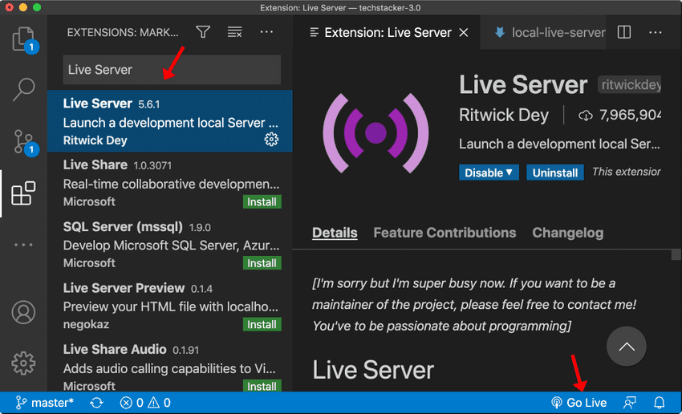
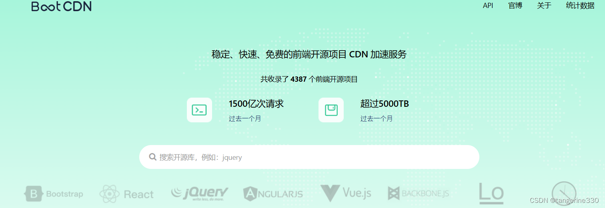

<p align='center'>
  
</p>

<p align='center'>日常工作中遇到的部分问题，html/css、js、typescript、vue2/vue3、react 解决案例合集</p>

<p align="center">
   
   
   
   
   
   
   
   
</p>

<br/>

<p align='center'>
  简体中文 | <a href='./README.en.md'>English</a>
</p>

<br/>

## 介绍

&emsp;&emsp;旨在记录日常工作中，遇到的一些问题，在解决过程中写的案例，又或者是持续学习过程中，遇到有趣并想分享出来的代码，主要涉及前端语言、框架、构建辅助工具、第三方代码库、自己写的工具函数。

## 清单

<details><summary>📝 纯文本清单（点击展开）</summary><br/><h3>html/css js（17）</h3><ul><li><a href="./javascript/game-maze/index.html">1.简易迷宫-数据相关（三维数组）</a></li><li><a href="./javascript/pseudo-code/commonjs-require.js">2.伪代码-CommonJS规范导入函数 require</a></li><li> <a href="./javascript/small-case/adaptation.html">3.移动端简易适配方案（缩放viewPort或rem方案）</a></li><li><a href="./javascript/small-case/canvas.html">4.canvas 画布demo-api</a></li><li><a href="./javascript/small-case/countdown.html">5.倒计时</a></li><li><a href="./javascript/small-case/dragbleApi.html">6.拖拽原生API</a></li><li><a href="./javascript/small-case/file-suffix.html">7.后端响应头的 attachment 中通过正则截取文件后缀名</a></li><li><a href="./javascript/small-case/inaccurate-timing.html">8.解决页面失活导致计时不准问题</a></li><li><a href="./javascript/small-case/indexedDB.html">9.浏览器存储-indexedDB，存储大量结构化数据</a></li><li><a href="./javascript/small-case/largeFile-chunks.html">10.大文件，开启多线程分片</a></li><li><a href="./javascript/small-case/layout-grid.html">11.grid 布局</a></li><li><a href="./javascript/small-case/lorem.html">12.Vscode 插件-Chinese Lorem，生成指定长度随机汉字</a></li><li><a href="./javascript/small-case/mimeticStyle.html">13.拟态风格页签（tab-按压）</a></li><li><a href="./javascript/small-case/scrollingNotice.html">14.滚动公告（附加:not()伪类测试）</a></li><li><a href="./javascript/small-case/strBytes.html">15.通过码元获取字符真实长度并计算所占字节数</a></li><li><a href="./javascript/small-case/text-stroke.html">16.解决文字阴影锯齿问题</a></li><li><a href="./javascript/small-case/upload-progress.html">17.模拟上传进度展示（进度条、速率、剩余传输预估时间）</a></li></ul><h3>第三方库（4）</h3><ul><li><a href="./dependent_libraries/bignumber.html">1.bignumber.js-解决js运算精度丢失问题</a></li><li><a href="./dependent_libraries/dayjs.html">2.dayjs-日期相关计算</a></li><li><a href="./dependent_libraries/index.less">3.less、less-loader，css工程化预处理器less</a></li><li><a href="./dependent_libraries/nprogress.html">4.nprogress-模拟组件加载时，顶部展示加载进度条</a></li></ul><h3>自定义工具函数（5）</h3><ul><li><a href="./utils/fileHandler.js">1.文件处理相关</a></li><li><a href="./utils/fileWorker.js">2.文件分片线程通信文件</a></li><li><a href="./utils/string.js">3.string类型数据处理方法</a></li><li><a href="./utils/index.js">4.其它工具函数</a></li><li><a href="./utils/myPromise.js">5.手写实现Promise</a></li></ul><h3>Typescript（5）</h3><ul><li><a href="./typescript/types/fileHandler.d.ts">1.文件处理相关方法类型申明</a></li><li><a href="./typescript/types/fileWorker.d.ts">2.文件分片线程通信类型申明</a></li><li><a href="./typescript/types/string.d.ts">3.string类型数据处理方法类型申明</a></li><li><a href="./typescript/types/index.d.ts">4.其它工具函数类型申明</a></li><li><a href="./typescript/type_tool/index.d.ts">5.实现 Record、Exclude、Extract、Pick、Omit、Partial、Required</a></li></ul><h3>vue2（2）</h3><ul><li><a href="./vue/vue2/DynamicForm/index.html">1.页面表单类型由后端控制（动态表单）</a></li><li><a href="./vue/vue2/TabWithLoading/index.html">2.选项卡切换附带水波纹loading</a></li></ul><h3>vue3（8）</h3><ul><li><a href="./vue/vue3/vueProxy/test.html">1.手写实现 vue3 响应式核心测试</a></li><li><a href="./vue/vue3/vueProxy/core/effect.js">2.实现watchEffect 核心，收集响应式数据和用到它们的函数的关联</a></li><li><a href="./vue/vue3/vueProxy/core/handler.js">3.响应式数据处理代理操作 get、set、deleteProperty、has、ownKeys</a></li><li><a href="./vue/vue3/vueProxy/core/reactive.js">4.实现 reactive ，利用 Proxy 递归代理，将数据变为响应式</a></li><li><a href="./vue/vue3/vueProxy/types/operationType.js">5.响应式数据操作类型</a></li><li><a href="./vue/vue3/vueProxy/computed.js">6.实现 computed</a></li><li><a href="./vue/vue3/vueProxy/ref.js">7.实现 ref</a></li><li><a href="./vue/vue3/vueProxy/watch.js">8.实现 watch</a></li></ul><h3>react（3）</h3><ul><li><a href="./react/data/ag-grid-react-data.html">1.请求后端的数据，转换适配组件ag-grid-react表格所需</a></li><li><a href="./react/react.html">2.引入react18、react-dom、antd、babel-standalone的cdn编译jsx实现预览</a></li><li><a href="./react/component/IconButton/index.jsx">3.基于antd的Button封装自定义图标按钮</a></li></ul><h3>构建、提交工具配置（3）</h3><ul><li><a href="./typescript/scripts/ts-node.ts">1.process.argv.slice(2) 获取脚本参数，ts-node 执行ts脚本</a></li><li><a href="./typescript/tsconfig.json">2.ts配置文件-tsconfig.json</a></li><li><a href="./commitlint.config.cjs">3.commitlint、cz-git 配置文件（规范和校验提交信息）</a></li></ul></details> <br/><br/>

> 👉🏻 点击下方按钮，查看源码

<br/>

<!--detail-start-->

<br/><a href="./javascript/game-maze/index.html" ></a> <a href="./javascript/pseudo-code/commonjs-require.js" ></a> <a href="./javascript/small-case/adaptation.html" ></a> <a href="./javascript/small-case/canvas.html" ></a> <a href="./javascript/small-case/countdown.html" ></a> <a href="./javascript/small-case/dragbleApi.html" ></a> <a href="./javascript/small-case/file-suffix.html" ></a> <a href="./javascript/small-case/inaccurate-timing.html" ></a> <a href="./javascript/small-case/indexedDB.html" ></a> <a href="./javascript/small-case/largeFile-chunks.html" ></a> <a href="./javascript/small-case/layout-grid.html" ></a> <a href="./javascript/small-case/lorem.html"></a> <a href="./javascript/small-case/mimeticStyle.html" ></a> <a href="./javascript/small-case/scrollingNotice.html" ></a> <a href="./javascript/small-case/strBytes.html" ></a> <a href="./javascript/small-case/text-stroke.html" ></a> <a href="./javascript/small-case/upload-progress.html" ></a> <br/><br/><br/><a href="./dependent_libraries/bignumber.html" ></a> <a href="./dependent_libraries/dayjs.html" ></a> <a href="./dependent_libraries/index.less" ></a> <a href="./dependent_libraries/nprogress.html" ></a> <br/><br/><br/><a href="./utils/fileHandler.js" ></a> <a href="./utils/fileWorker.js" ></a> <a href="./utils/string.js" ></a> <a href="./utils/index.js" ></a> <a href="./utils/myPromise.js" ></a> <br/><br/><br/><a href="./typescript/types/fileHandler.d.ts" ></a> <a href="./typescript/types/fileWorker.d.ts" ></a> <a href="./typescript/types/string.d.ts" ></a> <a href="./typescript/types/index.d.ts" ></a> <a href="./typescript/type_tool/index.d.ts" ></a> <br/><br/><br/><a href="./vue/vue2/DynamicForm/index.html" ></a> <a href="./vue/vue2/TabWithLoading/index.html" ></a> <br/><br/><br><a href="./vue/vue3/vueProxy/test.html" ></a> <a href="./vue/vue3/vueProxy/core/effect.js" ></a> <a href="./vue/vue3/vueProxy/core/handler.js" ></a> <a href="./vue/vue3/vueProxy/core/reactive.js" ></a> <a href="./vue/vue3/vueProxy/types/operationType.js" ></a> <a href="./vue/vue3/vueProxy/computed.js" ></a> <a href="./vue/vue3/vueProxy/ref.js" ></a> <a href="./vue/vue3/vueProxy/watch.js" ></a> <br/><br/><br/><a href="./react/data/ag-grid-react-data.html" ></a> <a href="./react/react.html" ></a> <a href="./react/component/IconButton/index.jsx" ></a> <br/><br/><br><a href="./typescript/scripts/ts-node.ts"></a> <a href="./typescript/tsconfig.json" ></a> <a href="./commitlint.config.cjs" ></a>

<!--detail-end-->

## 预览 & 提交

🚀 下载安装 _package.json_ 中的包

```bash
pnpm install
```

- 预览 - 方式 1

&emsp;&emsp;下载 _Vscode_ 插件 _Live Server_，点击右下角 _Go Live_ 开启实时预览服务器后，[跳转预览 (http://localhost:5500)](http://localhost:5500)

<br/>

<p align="center">
  
</p>

<br/>

- 预览 - 方式 2

&emsp;&emsp;运行如下终端命令，使用 _serve_ 和 _open-cli_ 开启实时预览服务器并自动在默认浏览器链接[预览地址 (http://localhost:8888)](http://localhost:8888)

```bash
# pnpm
pnpm start

# npm
npm start
```

<br/>

- 开源库 CDN

> 特别感谢开源库 CDN [BootCDN](https://www.bootcdn.cn/)
>
> ✨ 日常 demo 不用搭建整个工程， npm 对应包运行，直接创建 _html_ 文件引入 开源库 CDN，_script_ 脚本中直接使用即可
>
> 🚀 若有页面解析加载，引入 CDN 的同时，使用资源提示符 _defer_ - 避免加载 JS 导致渲染主线程处于空闲状态

```html
<!-- 引入CDN使用defer资源提示符 -->
<script src="CDN 地址" defer></script>
```

<br/>

<p align="center">
  
</p>

<br/>

- 执行 typescript 文件和规范提交

> 🌐 浏览器不支持 _typescript_ 文件，只会将其视为文件触发下载行为，需要下载 _typecript_ 包，用其自带的 _tsc_ 命令行工具编译成 _js_ 文件才行
>
> 💡 因 VSCode 本身对 typescript 语法的支持及高亮显示，因此可直接在 VSCode 中查看文件。
>
> 💻 执行 ts 文件，可使用库 _ts-node_ 和 _typescript_，配置 _tsconfig.json_ 文件，执行即 `npx ts-node 文件路径`，若全局安装了 _ts-node_ 可省略 npx

🧩 该案例中，可运行如下终端命令，执行 ts 文件

```bash
# 'typescript/index.ts' 可替换为需要执行的ts文件路径

# pnpm
pnpm ts typescript/index.ts

# npm
npm run ts typescript/index.ts
```

📋 使用 _husky_、_commitlint_、_commitizen_、_cz-git_ 在终端中添加交互式信息提交导航，以规范 _git_ 提交信息

```bash
# pnpm
pnpm commit

# npm
npm run commit

```

<br/>

<p align="center">
  
</p>

## 文件树概述

```text
daily_demo
├─ .husky                                 # 定义在git提交的指定钩子中额外执行脚本
│  ├─ commit-msg                          # 提交信息 git commit 时触发的钩子
│  └─ _
│     └─ husky.sh
├─ assets                                 # 资源文件
├─ dependent_libraries                    # 第三方库demo
├─ javascript                             # demo for js
├─ main.ts                                # pnpm ts main.ts 测试ts文件执行
├─ react                                  # demo for react
├─ README.md                              # 文档（简体中文）
├─ README.en.md                           # 文档（English）
├─ typescript                             # demo for ts
├─ utils                                  # 自定义公用方法相关
└─ vue                                    # demo for vue

```

## 参与贡献

&emsp;&emsp;🎉🎉🎉

&emsp;&emsp;如果你有兴趣，可以分享你在日常工作中遇到的问题和解决思路，或者单纯自己感兴趣的案例，谢谢 🤝🏻

- 分享感兴趣的库、github 地址、案例等

- 分享你在真实项目中遇到的问题（无论你解决与否）- 大家会一起帮你找到解决的思路

- 通过在 Issue 下留言帮助他人

- 分享可以以提 PR 的方式，或者 Issue 留言贴链接等

## 使用的协议

MIT
